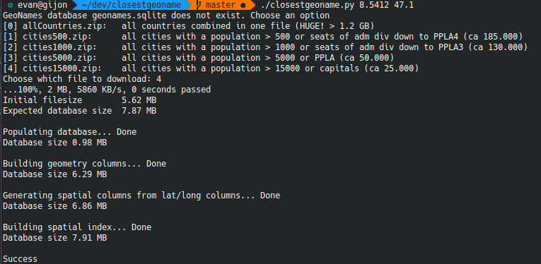

# closestgeoname
This program was written to avoid harrassing the API of a poor online server when requesting countless amount of place name geolocation requests in an application.

The program downloads a placename database from [GeoNames](http://download.geonames.org/export/dump/) and generates an SQLite database. SQLite's SpatiaLite addon is then used to generate a spatial index for extremely fast querying to return the closest place name for a given latitude and longitude

# Usage

On first run, if there is no *geonames.sqlite* file in the directory, it will prompt you to download from a choice of hardcoded links to the GeoNames server. 

**Beware of the file sizes and your RAM** when choosing your desired database, the complete allCountries.txt (1.4 GB) file will consume about 1.9 GB after generating the SQLite DB with spatial index. On downloading and building, it will require double this and need about 8-10 GB of RAM.

The script's primary purpose is to offer functionality to other python programs, but can be used from the command line as seen in the examples below.

# Examples

On first run:

Acceptable arguments:

Querying coordinates:

# License 

MIT/